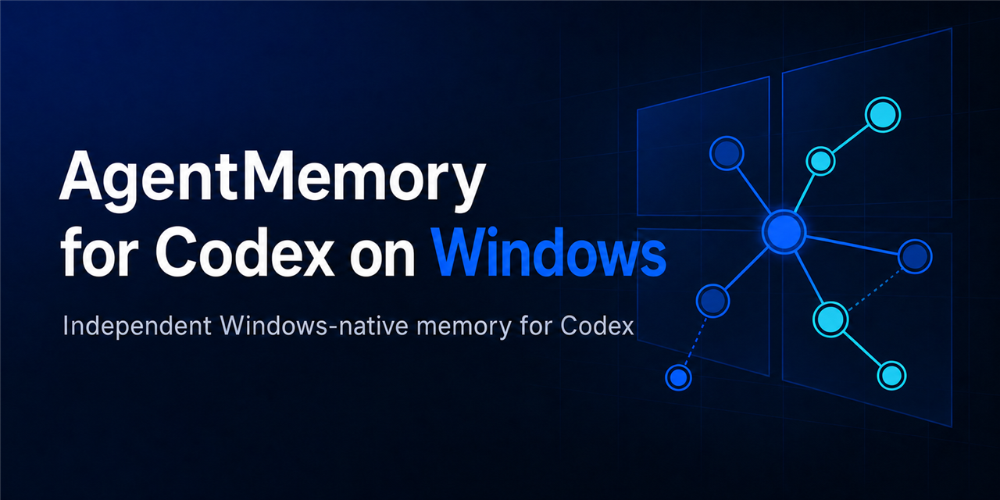

# Windows용 Codex AgentMemory

OpenAI Codex Desktop와 Codex CLI를 위한 독립 Windows 네이티브 AgentMemory
다운스트림입니다.

[English](../README.md) | [한국어](README.ko-KR.md) | [日本語](README.ja-JP.md)

[](../assets/social-preview.png)

> [!IMPORTANT]
> 이 저장소는 소스 전용 Technical Preview `0.1.0-preview.1`입니다.
> [AgentMemory](https://github.com/rohitg00/agentmemory) `v0.9.29`를 기반으로
> 하지만 공식 upstream 저장소나 `@agentmemory/*` npm 배포본이 아니며,
> upstream 지원을 약속하지 않습니다. upstream `npx` 명령이나 호환성용
> 플러그인 manifest를 아래 Windows 빌드·설치 절차 대신 사용하지 마세요.

개발 안내: 이 다운스트림은 AI가 생성하고 사용자가 시험했습니다. [전체
고지](#ai-개발-고지)를 확인하세요.

> **Windows에서 Codex로 평가하기**
>
> 네이티브 Windows에서 이 저장소를 Codex로 열고 [`INSTALL_FOR_AGENTS.md`](../INSTALL_FOR_AGENTS.md)를 따르도록 요청하세요. 이 실행 안내서는 고정된 네이티브 입력과 소스 체크아웃을 검증하고, 기본적으로 설치 프로그램을 dry-run/검증 전용 모드로 유지하며, 실제 cutover를 위해 `-Execute`를 추가하기 전 명시적 승인을 요구합니다. 해시, 소유권, 경로, 매니페스트 또는 이전 설치 상태가 일치하지 않으면 중단하세요.

## 이 공개판이 제공하는 것

- `SessionStart`, `UserPromptSubmit`, `Stop`, `SessionEnd` 네 개의 관리형
  Codex 훅으로 메인 에이전트의 정상 사용자 입력과 최종 답변을 수집합니다.
- 주변 UI 상태, 제목·fork 트래픽, 알려진 내부 호스트 프롬프트, subagent
  트래픽은 영속 수집에서 제외합니다.
- 쓰기·삭제·curation·provenance는 정확한 현재 프로젝트 범위로 제한합니다.
- 프로젝트 간 읽기는 제한된 수량으로 수행하고 출처 프로젝트를 표시하며,
  wildcard 쓰기는 허용하지 않습니다.
- 선택적으로 인증정보가 없는 loopback 전용 로컬 Qwen을 typed graph 추출에만
  사용합니다. 다른 LLM 기능은 noop provider를 사용하고 외부 fallback은 꺼 둡니다.
- 지원 프로필은 인증된 loopback MCP endpoint를 사용하며, stdio launcher는
  호환성 경로로만 패키징합니다.

upstream 호환 소스 surface에는 56 MCP tools, 6 resources, 3 prompts,
port 3111의 133 REST endpoints, 12 portable hooks, 17 skills가 있습니다.
지원 Windows 프로필은 위 네 개의 관리형 훅만 의도적으로 활성화합니다.

## 버전 구분

| 구분 | 값 | 의미 |
|---|---:|---|
| 공개 다운스트림 버전 | `0.1.0-preview.1` | 저장소 공개판과 소스 tag |
| AgentMemory 호환 버전 | `0.9.29` | CLI, MCP, package, API, export, 설치 runtime 호환성 |
| 검증 개정 | `r32` | 내부 빌드 provenance이며 공개 버전이 아님 |
| iii engine | `0.11.2` | 빌드 중 SHA-256을 확인하는 고정 Windows 입력 |

정확한 upstream tag, commit, tree, 원본 package hash는
[`upstream-source.json`](../upstream-source.json)에 기록되어 있습니다.

## 요구 환경

- PowerShell 5.1 이상이 있는 Windows; 현재 공개판은 Windows 11에서 검증
- Node.js 20 이상
- 저장소가 고정한 pnpm `11.19.0`
- [`third-party-inputs.json`](../packaging/windows-codex/config/third-party-inputs.json)의
  SHA-256과 일치하는 공식 iii engine `0.11.2` Windows 실행 파일

첫 소스 공개판에는 미리 빌드되거나 서명된 installer를 첨부하지 않습니다.

## 소스에서 빌드하기

Windows PowerShell에서 다음과 같이 실행합니다. 출력 폴더는 미리 존재하면 안
됩니다.

```powershell
git clone https://github.com/M-T-D-N/agentmemory-codex-windows.git
Set-Location agentmemory-codex-windows

& .\packaging\windows-codex\Build-WindowsCodex.ps1 `
  -OutputDirectory D:\staging\agentmemory-codex `
  -IiiEnginePath D:\inputs\iii-0.11.2.exe
```

정상 빌드는 native 입력 hash, 고정 lockfile, skill 일관성, typecheck, build,
package test, Codex adapter test, production dependency tree와 전체 immutable-file
manifest를 확인합니다.

installer는 기본적으로 dry-run이며 파일 hash, 소유권, 정확한 경로와 기존 설치
상태만 확인합니다. `-Execute`를 사용하기 전에 영문
[`Windows/Codex 운영 가이드`](../packaging/windows-codex/README.md)의 build,
cutover, rollback, 보존, 인증 계약을 전부 검토하세요.

> [!WARNING]
> 이 installer는 소유권이 확인된 관리형 AgentMemoryCodex 서비스 배치를
> 대상으로 합니다. 무관한 폴더에 적용하거나 build 산출물을 사용자 데이터로
> 취급하지 마세요. 정본 `data`, 비밀정보, log, task identity, rollback 자료는
> 서로 독립된 수명주기를 가집니다.

## 개인정보·보안 경계

- 지원 프로필의 MCP와 서비스 트래픽은 인증된 loopback endpoint에 머뭅니다.
- 선택형 Qwen provider는 인증정보 없는 loopback HTTP만 허용하며 graph 추출로
  기능이 제한됩니다.
- 공개 소스에는 memory database, session transcript, 사용자 export, API key,
  생성 installer, 개인 개발 Git 이력이 포함되지 않습니다.
- 보안 문제는 GitHub 비공개 취약점 신고 기능으로 제보합니다. 자세한 내용은
  [`SECURITY.md`](../SECURITY.md)를 확인하세요.

## 저장소 구성

| 경로 | 역할 |
|---|---|
| `src/` | AgentMemory 호환 소스 |
| `packaging/windows-codex/` | 지원 대상 Windows/Codex adapter, builder, installer, test |
| `plugin/` | 소스 build에 포함되는 upstream 호환 자산; 지원 설치 경로는 아님 |
| `test/` | 단위·보안 회귀 test |
| `benchmark/`, `eval/` | upstream 유래 harness와 과거 참고 결과; Windows 공개판 검증 결과는 아님 |
| `integrations/` | 호환성 integration이며 별도 다운스트림 지원 제품은 아님 |
| `upstream-source.json` | 정확한 upstream provenance |

upstream 홍보 website, cloud 배포 예제, 그 밖의 upstream 언어 사본, 생성 build 산출물,
개인 monorepo 이력은 첫 공개 저장소에 포함하지 않습니다. 과거 benchmark 자료는
재현 참고용으로만 남기며, 그 수치는 이 다운스트림 공개판의 성능 주장이 아닙니다.

## 개발 검증

```powershell
pnpm install --frozen-lockfile
pnpm run skills:check
pnpm run typecheck
pnpm run build
pnpm test
node packaging/windows-codex/tests/codex-turn.test.mjs
```

package manifest는 upstream `@agentmemory/*` 이름으로 실수로 배포되는 것을 막기
위해 `private`로 설정되어 있습니다. 기여 방법은
[`CONTRIBUTING.md`](../CONTRIBUTING.md), 다운스트림 변경 기록은
[`CHANGELOG.md`](../CHANGELOG.md)를 확인하세요.

## AI 개발 고지

다운스트림 변경 대부분은 사용자가 제공한 요구사항과 반복적인 수용 요청에 따라
OpenAI Codex가 작성·수정했습니다. 저장소 소유자는 소스 코드를 직접 읽거나
검토하지 않았습니다. 검증은 소유자의 Windows/Codex 환경에서 수행한 자동화
테스트와 실제 기능 시험을 근거로 합니다. 독립적인 제3자 코드 검토나 보안 감사는
수행되지 않았습니다.

**요약:** AI가 생성하고 사용자가 시험했으며, 수동 코드 리뷰를 거치지 않았습니다.

## Upstream 표기와 라이선스

이 다운스트림은 Rohit Ghumare와 기여자들의 AgentMemory를 기반으로 합니다.
표기와 정확한 원본 정보는 [`NOTICE`](../NOTICE)와
[`upstream-source.json`](../upstream-source.json)에 있으며, 코드는
[Apache License 2.0](../LICENSE)으로 제공됩니다.
