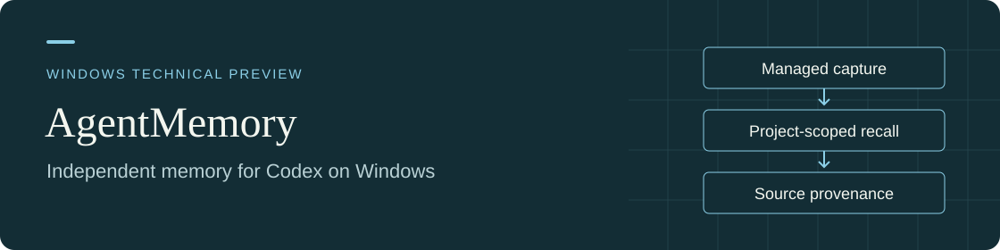

# Windows용 Codex AgentMemory

<p align="center">
  
</p>

OpenAI Codex Desktop와 Codex CLI를 위한 독립 Windows 네이티브 AgentMemory
다운스트림입니다.

[English](../README.md) | [한국어](README.ko-KR.md) | [日本語](README.ja-JP.md)

[빌드 없이 설치](#빌드-없이-설치하기) · [운영 가이드](../packaging/windows-codex/README.md) · [검증 범위](#검색필터인덱스의-동작과-검증-범위) · [릴리스 변경](../CHANGELOG.md)

> [!IMPORTANT]
> 이 저장소는 독립 Technical Preview `0.1.0-preview.15`입니다.
> [AgentMemory](https://github.com/rohitg00/agentmemory) `v0.9.30`를 기반으로
> 하지만 공식 upstream 저장소나 `@agentmemory/*` npm 배포본이 아니며,
> upstream 지원을 약속하지 않습니다. upstream `npx` 명령이나 호환성용
> 플러그인 manifest를 아래 Windows 빌드·설치 절차 대신 사용하지 마세요.

개발 안내: 이 다운스트림은 AI가 생성하고 사용자가 시험했습니다. [전체
고지](#ai-개발-고지)를 확인하세요.

## 처음 시작하기

1. Windows x64, Node.js 24+, Windows PowerShell 5.1과 Codex desktop을 확인하고 [고정 버전 설치 가이드](../packaging/windows-codex/npm/README.md)를 따르세요. 빌드된 실행본이 제공되므로 소스 빌드는 선택 사항입니다.
2. 설치 경로를 dry-run으로 확인한 뒤 `--execute`를 사용하세요. 빈 대상은 기본 경로에서 준비·활성화·서비스 확인을 진행합니다. `--fresh`와 `--activate-prepared`로 단계를 나눌 수도 있습니다. 서비스 확인 뒤 Codex MCP를 연결하세요.
3. 실패하면 [지원 안내](../SUPPORT.md)에 따라 버전과 실패 단계, 민감정보를 지운 짧은 오류를 알려주세요. 기억 데이터베이스나 인증정보는 첨부하지 마세요.

## 이 공개판이 제공하는 것

- `SessionStart`, `UserPromptSubmit`, `Stop`, `SessionEnd` 네 개의 관리형
  Codex 훅으로 메인 에이전트의 정상 사용자 입력과 최종 답변을 수집합니다.
- 주변 UI 상태, 제목·fork 트래픽, 알려진 내부 호스트 프롬프트, subagent
  트래픽은 영속 수집에서 제외합니다.
- 쓰기·삭제·curation·provenance는 정확한 현재 프로젝트 범위로 제한합니다.
- 감사 기록과 dry-run을 갖춘 대상 한정 live graph provenance 정정을 지원합니다.
  여러 source group을 수동 graph write에 사용할 때는 각 node·edge에 0부터 시작하는
  `sourceIndexes`를 지정하거나, 의도적인 공유 출처임을 `sharedSources: true`로
  명시해야 합니다.
- 정확한 ID·버전·graph cursor를 보존하는 검증된 빈 observation의 삭제·복구를
  기존 REST forget endpoint에서 지원합니다.
- 프로젝트 간 읽기는 제한된 수량으로 수행하고 출처 프로젝트를 표시하며,
  wildcard 쓰기는 허용하지 않습니다.
- 선택적으로 인증정보가 없는 loopback 전용 로컬 Qwen을 typed graph 추출에만
  사용합니다. 다른 LLM 기능은 noop provider를 사용하고 외부 fallback은 꺼 둡니다.
- 지원 프로필은 인증된 loopback MCP endpoint를 사용하며, stdio launcher는
  호환성 경로로만 패키징합니다.

upstream 호환 소스 surface에는 58 MCP tools, 6 resources, 3 prompts,
port 3111의 143 REST endpoints, 12 portable hooks, 17 skills가 있습니다.
지원 Windows 프로필은 위 네 개의 관리형 훅만 의도적으로 활성화합니다.

감사 목적의 MCP `memory_recall`, `memory_smart_search`, `memory_timeline`에는
`trackAccess: false`를 지정할 수 있습니다. 조회 횟수에 따른 강화만 끄며,
프로젝트 경계·가시성·삭제 복구 보호는 유지합니다. 기본값은 true입니다.
그래프 조회 색인은 정본 그래프와 같은 iii 저장소에 있습니다. 색인이 없거나
오래되면 경고와 제한된 snapshot을 반환하며, 명시적 snapshot rebuild로 갱신합니다.

공개판 변경은 [변경 기록](../CHANGELOG.md)에 정리합니다. 소스 tag는 공개판을,
각 빌드 manifest는 해당 산출물의 검증 개정을 식별합니다.

## preview.15의 변경점

AgentMemory 0.9.30과 iii engine/SDK 0.22.1을 반영했습니다. 신규 설치·관리형 갱신·
지원 원본 인계를 하나의 설치기로 처리하며 정본 데이터와 인증·출처를 보존합니다.
패치된 engine은 관리형 쓰기의 파일 flush를 기다리고, viewer 복구는 제한된 key page로
읽습니다. 의도적으로 제외한 수집을 오류로 쌓지 않고 일반 LLM과 graph provider 상태를
구분합니다. 성공한 빌드의 호출 전용 임시 자료는 정리하며 실패 자료는 보존합니다.
실제 Windows 설치·재시작·원본 인계·실패 복구 시험을 수행했으며, 검증 범위와
정전 복구·서명·다른 PC의 미검증 한계는 [변경 기록](../CHANGELOG.md)에 남깁니다.

## 검색·필터·인덱스의 동작과 검증 범위

일반 검색은 저장된 원문·lesson과 그래프를 조회하며 Qwen에 답변 생성을 요청하지
않습니다. Qwen은 별도의 백그라운드 그래프 추출에만 사용합니다. 후보를 최종 건수로
제한하기 전에 정본의 프로젝트·발화자·보관 상태·주변 UI 출처를 확인하고, 코드·인용문
안의 원문은 보존합니다. `memory_smart_search` 후보의 `expandIds`로 출처를 확인합니다.

키워드 snapshot과 그래프 조회 shard는 재생성 가능한 인덱스입니다. 표현을 축소해도
정본 대화·원문·ID는 삭제하지 않습니다. preview.14는 여러 시작점이 같은 원문에
도달할 때 가장 높은 점수의 후보와 해당 문맥·출처를 함께 유지합니다. 먼저 발견한
약한 연결이 나중의 직접 일치를 가리던 문제를 수정했습니다.

기존 검사는 검색·필터·수집·그래프 출처·인증·설치·복구를 다룹니다. 이번 회귀 검사는
시작점의 양쪽 순서, 직접 일치, 더 짧은 확장, 출처 교체와 결과 제한을 확인합니다.
실제 설치본은 기대 원문 ID가 고정된 과거 질문 50건으로 확인하며 정확한 결과는
release 설명에 남깁니다. 단위 검사 통과와 실제 환경의 성공을 구분합니다.

preview.13에서 재현된 약 6초 지연은 MCP 완료까지 약 1.4초, 이후 호출 스크립트
재개까지 약 4.5초가 더 걸린 사례입니다. 완료 이후 구간의 정확한 원인과 다른 대화의
영향은 미확정이며 이번 순위 수정으로 그 지연이 해결됐다고 주장하지 않습니다.
AdGuard·리다이렉트 드라이버 호환성도 미검증입니다. 자세한 기능과 검증 한계는
[영문 설명](../README.md#how-search-filtering-and-indexes-work)을 참조하세요.

## 그래프 갱신 시점

1. 관리형 훅이 정상 대화를 observation으로 저장합니다. 새 observation의 저장이
   완료되면 기존 backlog scheduler를 깨웁니다. 거부·중복 입력은 깨우지 않으며,
   깨우기 실패도 이미 저장한 observation을 무효화하지 않습니다.
2. 현재 Codex 모델이 작업 중 결정한 사안과 검증된 해결책 중 재사용할 내용을
   공식 memory·lesson·graph 도구로 출처와 함께 선별 기록합니다. 최종 답변을
   수집했다는 사실만으로 그 내용을 검증된 결정으로 승격하지 않습니다.
3. 선택형 로컬 Qwen graph provider가 설정되어 있고 사용 가능하면 제한된 batch로
   그래프를 보강합니다. runtime 준비 상태가 15초간 안정적인지 확인하며, 이미
   안정적인 runtime은 observation 저장 때마다 다시 15초를 기다리지 않습니다.
   drain당 최대 4 batch를 처리하고 모두 처리하면 30초 간격으로 이어갑니다.
   신호 누락·재시작은 15분 복구 확인으로 처리하며 전경 Qwen 작업이 있으면 cursor를
   넘기지 않고 미룹니다.

Windows 어댑터는 Qwen이 꺼져 있고 기존 선택 기준상 처리할 observation이 있으면
작업공간의 LocalAI launcher에 조건부 기동을 자동 요청합니다. 수동 보류·메모리 여유·
공유 GPU 보호는 기존 launcher가 판정하며, 보류 후에는 15분 복구 주기로 재확인합니다.
이 worker가 직접 켠 인스턴스만 backlog가 빈 상태로 5분이 지나면 소유 토큰으로 종료합니다.
해당 LocalAI 설치가 없는 환경에서는 실행 중인 provider를 이용하는 기존 방식이 유지됩니다.
이 공개판에는 호스트 프로그램이나 모든 PC에 적용할 GPU/RAM 기준을 포함하지
않습니다. provider 없는 수동 curation과 구조적 graph 추출도 사용할 수 있습니다.

## 버전 구분

| 구분 | 값 | 의미 |
|---|---:|---|
| 공개 다운스트림 버전 | `0.1.0-preview.15` | 저장소 공개판과 소스 tag |
| AgentMemory 호환 버전 | `0.9.30` | CLI, MCP, package, API, export, 설치 runtime 호환성 |
| 검증 개정 | 빌드 manifest | 내부 빌드 provenance이며 공개 버전이 아님 |
| iii engine | `0.22.1` | 빌드 중 SHA-256을 확인하는 고정 Windows 입력 |

정확한 upstream tag, commit, tree, 원본 package hash는
[`upstream-source.json`](../upstream-source.json)에 기록되어 있습니다.

## 빌드 없이 설치하기

preview.15 GitHub Release의 ZIP 또는 버전이 고정된 TGZ 실행기와
[npm/npx 설치 안내](../packaging/windows-codex/npm/README.md)를 사용합니다.
Windows x64, Node.js 24 이상, Codex가 필요합니다. 업스트림을 먼저 설치할 필요는 없습니다.
기본 명령은 dry-run이며 `--execute`로 빈 대상의 설치·활성화·서비스 확인을 진행합니다.
기존 관리형 설치는 같은 루트에서 갱신하고, 원본 0.9.29/0.9.30 파일 저장소는
원본 package·data·설정 경로를 지정해 인계할 수 있습니다. 더 최신인 미지원 원본을 자동으로 내리지 않습니다.
기존 설치의 업데이트는 같은 설치 루트를 사용합니다. GitHub TGZ는 별도의
npm 레지스트리 게시 없이 npm으로 실행할 수 있습니다.
npm 12는 원격 TGZ를 기본 차단하므로 설치 명령의 `--allow-remote=root`로
명시한 실행기를 해당 호출에서 허용합니다. 전역 npm 설정은 바꾸지 않습니다.
[npm 정책](https://docs.npmjs.com/cli/install/#allow-remote)

## 소스 빌드 요구 환경

- PowerShell 5.1 이상이 있는 Windows; 현재 공개판은 Windows 11에서 검증
- Node.js 24 이상
- HTTP 회귀 테스트용 PATH의 Python 3 (CI는 Python 3.12 사용)
- 저장소가 고정한 pnpm `11.19.0`
- [`third-party-inputs.json`](../packaging/windows-codex/config/third-party-inputs.json)의
  SHA-256과 일치하는 다운스트림 패치 적용 iii engine `0.22.1` Windows 실행 파일

npm 실행기는 미리 빌드한 ZIP을 받습니다. 실행 파일에 Authenticode 서명은 없으며,
고정된 ZIP SHA-256과 파일별 manifest로 무결성을 확인합니다.

## 소스에서 빌드하기

Windows PowerShell에서 다음과 같이 실행합니다. 출력 폴더는 미리 존재하면 안
됩니다.

```powershell
git clone --branch v0.1.0-preview.15 https://github.com/M-T-D-N/agentmemory-codex-windows.git
Set-Location agentmemory-codex-windows

& .\packaging\windows-codex\Build-WindowsCodex.ps1 `
  -OutputDirectory D:\staging\agentmemory-codex `
  -IiiEnginePath D:\inputs\iii-0.22.1.exe `
  -ScratchDirectory D:\staging\agentmemory-build-temp `
  -ReleaseRevision r189
```

정상 빌드는 native 입력 hash, 고정 lockfile, skill 일관성, typecheck, build,
package test, Codex adapter test, production dependency tree와 전체 immutable-file
manifest를 확인합니다.

installer는 기본적으로 dry-run이며 파일 hash, 소유권, 정확한 경로와 기존 설치
상태만 확인합니다. `-Execute`를 사용하기 전에 영문
[`Windows/Codex 운영 가이드`](../packaging/windows-codex/README.md)의 build,
cutover, rollback, 보존, 인증 계약을 전부 검토하세요.

> [!WARNING]
> 이 installer는 소유권이 확인된 관리형 AgentMemoryCodex 서비스 배치를
> 대상으로 합니다. 무관한 폴더에 적용하거나 build 산출물을 사용자 데이터로
> 취급하지 마세요. 정본 `data`, 비밀정보, log, task identity, rollback 자료는
> 서로 독립된 수명주기를 가집니다.

## 기존 설치 업데이트

공개 tag의 소스와 새 staging 폴더에서 빌드하세요. 이미 설치한 개정과 다른
`-ReleaseRevision rN`을 선택합니다. 예시의 `r83`은 빌드 표기이며 기존 r83
runtime을 덮어쓸 권한을 뜻하지 않습니다. 동일한 소유 설치 경로에서 dry-run을
실행하고 predecessor·target을 확인한 뒤 승인된 cutover·rollback 절차를 따릅니다.
정본 데이터·비밀정보·인스턴스 정보는 설치 위치에 보존합니다. 이번 공개판에서
제외한 과거 일회성 session-stub migration은 실행하지 않습니다.
[에이전트 설치 안내](../INSTALL_FOR_AGENTS.md)에 상세 절차가 있습니다.

## 개인정보·보안 경계

- 지원 프로필의 MCP와 서비스 트래픽은 인증된 loopback endpoint에 머뭅니다.
- 선택형 Qwen provider는 인증정보 없는 loopback HTTP만 허용하며 graph 추출로
  기능이 제한됩니다.
- 공개 소스에는 memory database, session transcript, 사용자 export, API key,
  생성 installer, 개인 개발 Git 이력이 포함되지 않습니다.
- 보안 문제는 GitHub 비공개 취약점 신고 기능으로 제보합니다. 자세한 내용은
  [`SECURITY.md`](../SECURITY.md)를 확인하세요.

## 저장소 구성

| 경로 | 역할 |
|---|---|
| `src/` | AgentMemory 호환 소스 |
| `packaging/windows-codex/` | 지원 대상 Windows/Codex adapter, builder, installer, test |
| `plugin/` | 소스 build에 포함되는 upstream 호환 자산; 지원 설치 경로는 아님 |
| `test/` | 단위·보안 회귀 test |
| `benchmark/`, `eval/` | upstream 유래 harness와 과거 참고 결과; Windows 공개판 검증 결과는 아님 |
| `integrations/` | 호환성 integration이며 별도 다운스트림 지원 제품은 아님 |
| `upstream-source.json` | 정확한 upstream provenance |

upstream 홍보 website, cloud 배포 예제, 그 밖의 upstream 언어 사본, 생성 build 산출물,
개인 monorepo 이력은 첫 공개 저장소에 포함하지 않습니다. 과거 benchmark 자료는
재현 참고용으로만 남기며, 그 수치는 이 다운스트림 공개판의 성능 주장이 아닙니다.

## 개발 검증

```powershell
pnpm install --frozen-lockfile
pnpm run skills:check
pnpm run typecheck
pnpm run build
pnpm test
node packaging/windows-codex/tests/codex-turn.test.mjs
```

package manifest는 upstream `@agentmemory/*` 이름으로 실수로 배포되는 것을 막기
위해 `private`로 설정되어 있습니다. 기여 방법은
[`CONTRIBUTING.md`](../CONTRIBUTING.md), 다운스트림 변경 기록은
[`CHANGELOG.md`](../CHANGELOG.md)를 확인하세요.

## AI 개발 고지

다운스트림 변경 대부분은 사용자가 제공한 요구사항과 반복적인 수용 요청에 따라
OpenAI Codex가 작성·수정했습니다. 저장소 소유자는 소스 코드를 직접 읽거나
검토하지 않았습니다. 검증은 소유자의 Windows/Codex 환경에서 수행한 자동화
테스트와 실제 기능 시험을 근거로 합니다. 독립적인 제3자 코드 검토나 보안 감사는
수행되지 않았습니다.

**요약:** AI가 생성하고 사용자가 시험했으며, 수동 코드 리뷰를 거치지 않았습니다.

## Upstream 표기와 라이선스

이 다운스트림은 Rohit Ghumare와 기여자들의 AgentMemory를 기반으로 합니다.
표기와 정확한 원본 정보는 [`NOTICE`](../NOTICE)와
[`upstream-source.json`](../upstream-source.json)에 있으며, 코드는
[Apache License 2.0](../LICENSE)으로 제공됩니다.
